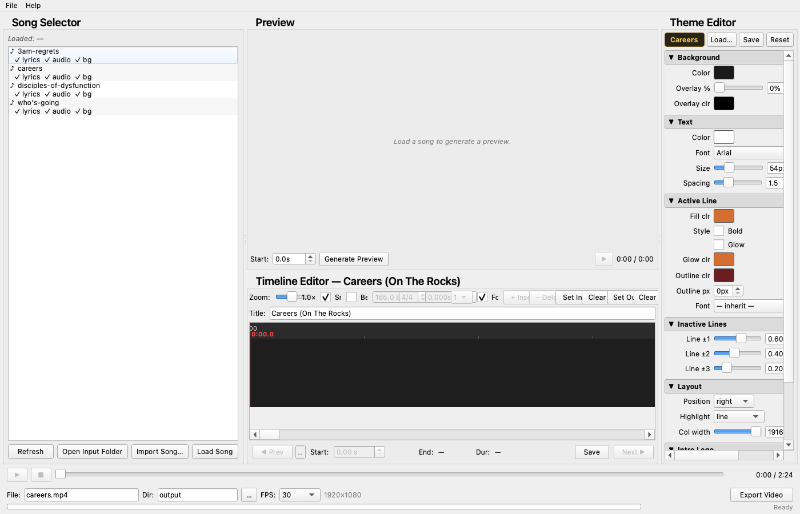
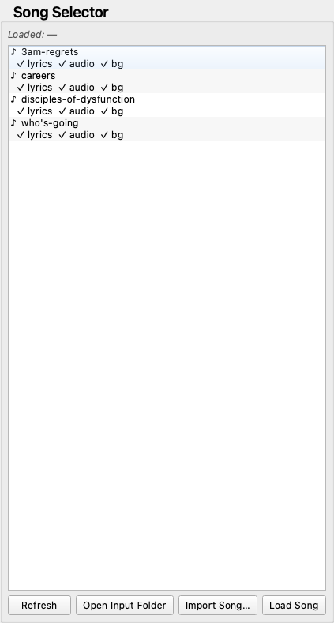
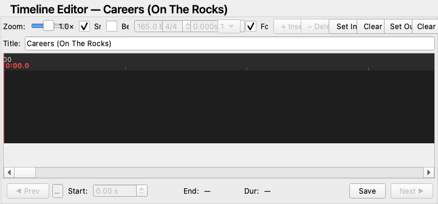
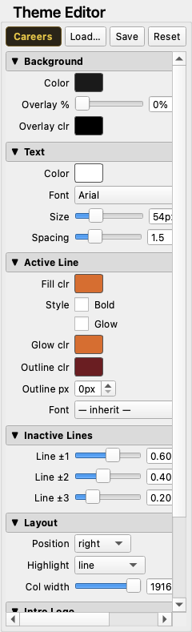
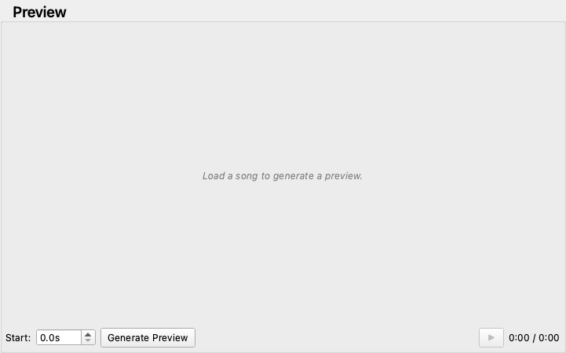

# LV-Gen User Manual

**Lyric Video Generator** — Generate YouTube-ready 1080p lyric videos from a JSON lyrics file and an audio track.

---

## Table of Contents

1. [Introduction](#1-introduction)
2. [Installation](#2-installation)
3. [Quick Start](#3-quick-start)
4. [Input Files](#4-input-files)
5. [Lyrics JSON Format](#5-lyrics-json-format)
6. [GUI Overview](#6-gui-overview)
7. [Song Selector](#7-song-selector)
8. [Timeline Editor](#8-timeline-editor)
9. [Theme Editor](#9-theme-editor)
10. [Preview Panel](#10-preview-panel)
11. [Export](#11-export)
12. [Keyboard Shortcuts](#12-keyboard-shortcuts)
13. [CLI Reference](#13-cli-reference)
14. [Troubleshooting](#14-troubleshooting)
15. [File Structure Reference](#15-file-structure-reference)

---

## 1. Introduction

LV-Gen generates YouTube-ready **1920×1080 MP4 videos** (H.264 video, AAC audio) from two ingredients: a JSON file containing your song's lyrics with timestamps, and an audio file. Optionally, a background video loops behind the lyrics.

LV-Gen has two interfaces that share the same rendering engine:

- **GUI** — A desktop application with a visual timeline editor, live theme editor, embedded preview player, and one-click export. This is the primary way most people use LV-Gen.
- **CLI** — A headless command-line tool for scripted or automated video generation.

**Prerequisites before you start:**

- A lyrics JSON file (see [Section 5](#5-lyrics-json-format))
- An audio file (MP3, WAV, or FLAC)
- FFmpeg installed on your system (see [Section 2](#2-installation))

---

## 2. Installation

### macOS (pre-built app)

1. Download the latest `LV-Gen-vX.X.X.dmg` from the [GitHub Releases page](https://github.com/CuWilliams/lyric-video-generator/releases)
2. Open the `.dmg` and drag **LV-Gen** to your Applications folder
3. Install FFmpeg if you haven't already:
   ```
   brew install ffmpeg
   ```
4. **First launch:** macOS may block the app with a Gatekeeper warning. Right-click **LV-Gen** → **Open** to bypass it. You only need to do this once.

> The app bundles all Python dependencies. Only FFmpeg needs to be installed separately.

### Source install (all platforms)

**Requirements:** Python 3.10+, FFmpeg

```bash
# Clone the repository
git clone https://github.com/CuWilliams/lyric-video-generator.git
cd lyric-video-generator

# Create and activate a virtual environment
python3 -m venv venv
source venv/bin/activate      # macOS / Linux
# venv\Scripts\activate       # Windows

# Install as an editable package (registers CLI commands)
pip install -e .
```

**FFmpeg installation by platform:**

| Platform | Command |
|----------|---------|
| macOS | `brew install ffmpeg` |
| Ubuntu / Debian | `sudo apt install ffmpeg` |
| Windows | Download from ffmpeg.org/download.html and add to PATH |

### System requirements (macOS app)

| Requirement | Minimum |
|-------------|---------|
| macOS | 11.0 (Big Sur) |
| Architecture | Apple Silicon or Intel |
| Disk space | ~500 MB (app) + FFmpeg |
| FFmpeg | Required separately |

---

## 3. Quick Start

The fastest path from nothing to a finished video:

1. **Prepare your input files** — Place your audio file in `input/audio/` and create a lyrics JSON file in `input/lyrics/`. Both files must share the same base name (e.g. `my-song.mp3` and `my-song.json`). See [Section 4](#4-input-files) for folder locations and [Section 5](#5-lyrics-json-format) for the JSON format.

2. **Launch LV-Gen** — Open the app from your Applications folder. The Song Selector (left panel) will list your song automatically.

3. **Load the song** — Click the song name in the Song Selector. All panels populate with your song's data.

4. **Stamp the lyrics** — If your lyrics JSON has all timestamps at zero, use Tap-to-Stamp to set them in real time:
   - Press **Space** to start playback
   - Press **Enter** each time you hear a lyric line begin
   - Press **Space** to pause
   - Press **⌘S** to save

5. **Export** — In the transport bar at the bottom, click **Export**. Your 1920×1080 MP4 video is saved to `output/`.

---

## 4. Input Files

Place files in the matching `input/` subdirectory. The **file names must match** across all three folders for auto-detection to work — LV-Gen finds your song by matching the base filename.

| Type | Folder | Accepted formats |
|------|--------|-----------------|
| Audio | `input/audio/` | `.mp3`, `.wav`, `.flac` |
| Lyrics | `input/lyrics/` | `.json` |
| Background | `input/backgrounds/` | `.jpg`, `.png`, `.mp4` |

**Example:** A song called "midnight-run" would need:
- `input/audio/midnight-run.mp3`
- `input/lyrics/midnight-run.json`
- `input/backgrounds/midnight-run.mp4` *(optional)*

Background is optional. If omitted, LV-Gen uses the solid `background_color` defined in the active theme.

---

## 5. Lyrics JSON Format

Lyrics are stored as a JSON file with a list of timed entries. Each entry specifies when a line should appear (in seconds from the start of the audio) and what text to display.

### Full example

```json
{
  "title": "Song Title",
  "artist": "Artist Name",
  "lyrics": [
    { "time": 0.0,   "text": "First lyric line" },
    { "time": 10.5,  "text": "Second lyric line" },
    { "time": 14.2,  "text": "Third lyric line" },
    { "time": 18.0,  "text": "Fourth lyric line" },
    { "time": 30.0,  "text": "" }
  ]
}
```

### Field reference

| Field | Type | Description |
|-------|------|-------------|
| `title` | string | Song title (used for output filename) |
| `artist` | string | Artist name |
| `lyrics` | array | List of timed lyric entries |
| `lyrics[].time` | float | When this line appears, in seconds |
| `lyrics[].text` | string | The lyric text to display |

### Timing rules

- Each line displays from its `time` until the next entry's `time`
- **The final entry must have `"text": ""`** — this is the end marker that defines when the last lyric line stops showing
- To create an instrumental gap (blank screen), space two timestamps far apart
- Starting all `time` values at `0.0` is valid — use the Timeline Editor's Tap-to-Stamp to fill them in (see [Section 8](#8-timeline-editor))
- If the first lyric appears after the audio starts (e.g. an instrumental intro), the video shows a blank background until the first line

---

## 6. GUI Overview



The application window has five panels:

| Panel | Location | Purpose |
|-------|----------|---------|
| Song Selector | Left column | Lists detected songs; click to load |
| Preview | Center top | Renders and plays back a preview clip |
| Timeline Editor | Center bottom | Visual timestamping and lyric editing |
| Theme Editor | Right column | All visual style controls |
| Transport + Export | Bottom bar | Playback controls and video export |

---

## 7. Song Selector



The Song Selector (left column) scans the `input/` folders and lists every song that has at least a lyrics file present.

- **Icons** next to each song name indicate which files are present: audio, lyrics, and background
- **Click a song** to load it into all panels
- If you have unsaved lyric changes when loading a new song, a dialog prompts: **Save / Discard / Cancel**

---

## 8. Timeline Editor



The Timeline Editor is the heart of LV-Gen's workflow. It visualizes your lyric markers as triangles on a horizontal ruler and lets you set timestamps either by dragging markers or by tapping along to the audio in real time.

### Visual elements

| Element | Appearance | Meaning |
|---------|-----------|---------|
| Ruler | Top strip | Time axis in M:SS |
| Blue triangle + line | Normal marker | An unselected lyric line |
| Yellow triangle + line | Highlighted marker | The currently selected line |
| Green triangle + line | Active marker | The line playing right now |
| Red vertical line | Cursor | Current playback position |

### Toolbar controls

| Control | Function |
|---------|----------|
| Zoom slider | Expand or compress the timeline horizontally |
| Ctrl + scroll | Zoom in/out with the mouse wheel |
| Snap 0.1s | Snaps dragged markers to the 0.1s grid (uncheck for free movement) |
| + Insert | Insert a new blank marker after the selected one |
| − Delete | Delete the selected marker |

### Marker Detail Strip

The strip at the bottom of the Timeline Editor shows the selected marker's data. All fields except End and Dur are editable:

| Field | Description |
|-------|-------------|
| ◀ Prev / Next ▶ | Navigate to adjacent markers |
| Text field | Edit the lyric line text |
| Start: | Exact start time in seconds (editable via spinner) |
| End: | Calculated end time (read-only) |
| Dur: | Calculated duration (read-only) |
| Save button | Save all changes to disk |

### Tap-to-Stamp workflow

Use this to timestamp a song from scratch (when all lyrics have `time: 0`):

1. Load the song — all markers pile up at the left edge (time 0), which is expected
2. Press **Space** to start playback
3. Press **Enter** each time you hear a lyric line begin
   - First tap auto-selects marker 0 if nothing is selected
   - Each tap stamps the current marker to the playback position, then advances to the next
4. Press **Space** to pause at any time
5. Press **⌘S** when done to save timestamps to the JSON file

**Recovering from misqueues:**

- **⌘Z** undoes the last stamp — the stamp cursor moves back to that marker
- Click anywhere on the timeline to seek the audio to the right spot (this clears the visual selection but the stamp cursor holds its position)
- Press **Enter** to resume stamping — the stamp cursor remembers where you left off

**Nuances:**

- Clicking **empty space** on the timeline seeks the audio and clears the visual selection — this is safe; the stamp cursor is not affected
- Clicking a **marker triangle** selects it and moves the stamp cursor to that index
- The stamp cursor only resets to 0 when a new song is loaded

### Inserting and deleting markers

**Insert after selected:**

1. Click the marker you want to insert after (it turns yellow)
2. Click **+ Insert** in the toolbar
3. A new blank marker appears at the midpoint between the selected marker and the next one
4. Type the lyric text in the detail strip's text field
5. Drag the marker or adjust the **Start:** spinner to set the correct time
6. Save with **⌘S**

**Delete selected:**

1. Click the marker to select it
2. Click **− Delete**
3. The marker is removed; the adjacent marker is auto-selected
4. Both Insert and Delete are fully undoable with **⌘Z**

**Known limitation:** Insert and Delete use fixed list indices in the undo stack. If you insert or delete a marker and then try to undo an earlier *move* operation (from before the insert/delete), that undo may act on the wrong marker. Treat insert/delete as final corrections — avoid mixing them with undoing earlier stamps.

---

## 9. Theme Editor



The Theme Editor (right column) controls the visual style of the output video. Every change is reflected in the Preview panel, which shows a ⚠ stale indicator until you re-render.

### Theme properties reference

**Colors**

| Property | Type | Description | Default |
|----------|------|-------------|---------|
| `background_color` | `#RRGGBB` | Canvas background color | `#1a1a1a` |
| `text_color` | `#RRGGBB` | Color of inactive lyric lines | `#ffffff` |
| `active_text_color` | `#RRGGBB` or null | Color of the currently active line. `null` uses `text_color` | `null` |
| `active_glow_color` | `#RRGGBB` or null | Color of the glow on the active line. `null` uses `active_text_color` | `null` |
| `text_shadow_color` | `#RRGGBB` | Color of the text drop shadow | `#000000` |

**Active line**

| Property | Type | Description | Default |
|----------|------|-------------|---------|
| `active_text_bold` | bool | Render the active line in bold | `false` |
| `active_text_glow` | bool | Enable a soft glow halo on the active line | `true` |

**Inactive lines**

| Property | Type | Description | Default |
|----------|------|-------------|---------|
| `inactive_text_opacity_gradient` | list of floats 0–1 | Opacity of lines 1, 2, 3 positions away from the active line | `[0.6, 0.4, 0.2]` |

**Font & layout**

| Property | Type | Description | Default |
|----------|------|-------------|---------|
| `font_family` | string | Font name (falls back through common system fonts) | `Arial` |
| `font_size` | int | Base font size in pixels | `72` |
| `line_spacing` | float | Line height as a multiplier of `font_size` (e.g. `1.5` = 1.5×) | `1.5` |
| `lyric_position` | `left` / `center` / `right` | Horizontal text alignment | `center` |

**Highlighting**

| Property | Type | Description | Default |
|----------|------|-------------|---------|
| `highlight_mode` | `line` / `word` / `character` | What unit gets highlighted as the line plays | `line` |
| `highlight_dim_alpha` | float 0–1 | Opacity of un-highlighted tokens in `word` or `character` mode | `0.3` |

**Text overlay**

| Property | Type | Description | Default |
|----------|------|-------------|---------|
| `text_overlay_opacity` | int 0–100 | Opacity of a solid-color strip behind the lyrics column | `0` |
| `text_overlay_color` | `#RRGGBB` | Color of that overlay | `#000000` |

**Text shadow**

| Property | Type | Description | Default |
|----------|------|-------------|---------|
| `text_shadow` | bool | Enable a drop shadow on all text | `false` |
| `text_shadow_color` | `#RRGGBB` | Shadow color | `#000000` |
| `text_shadow_offset` | `[x, y]` | Shadow offset in pixels | `[3, 3]` |

### Highlight modes

- **line** — the entire active line renders at full opacity in `active_text_color` (default)
- **word** — words in the active line are highlighted progressively as the line plays
- **character** — individual characters are highlighted progressively as the line plays

### Saving themes

- **⌘⇧S** saves the currently loaded theme file
- **File → Save Theme** is the menu equivalent
- **File → Open Theme…** loads a theme JSON from the `themes/` folder
- Theme files live in `themes/` — copy `themes/default.json` as a starting point for a new theme

---

## 10. Preview Panel



The Preview panel (center top) renders a short clip so you can check your timing and theme before committing to a full export.

- Click **Render Preview** to generate a preview of the first 30 seconds
- A **⚠ stale** indicator appears whenever lyrics or theme have changed since the last render — click Render Preview to refresh it
- Preview playback uses the same transport controls as the full audio player (Space to play/pause)

---

## 11. Export

The transport bar at the bottom of the window contains both playback controls and export settings.

| Control | Description |
|---------|-------------|
| Filename field | Output file name (without path) |
| Output directory | Defaults to `output/`; click the folder icon to change |
| FPS | Select 24, 30, or 60 frames per second |
| Export button | Starts the full render |
| Progress bar | Shows frame-by-frame render progress |
| Cancel button | Cancels a render cleanly mid-progress |

- If you have unsaved lyrics or theme changes, a dialog prompts before export begins
- Output is always **1920×1080 MP4** (H.264 video + AAC audio)
- Rendered files go to `output/` by default (this directory is not tracked by git)

---

## 12. Keyboard Shortcuts

| Shortcut | Action |
|----------|--------|
| **Space** | Play / Pause audio |
| **Enter** | Stamp selected marker to current playback position, advance to next |
| **← / →** | Step backward / forward by one snap unit (when audio is paused) |
| **⌘Z** | Undo last action (move, text edit, insert, delete) |
| **⌘⇧Z** | Redo |
| **⌘S** | Save lyrics to JSON |
| **⌘⇧S** | Save theme |

> **Note:** Space and Enter are blocked when a text field or spinner has focus, so typing in the Marker Detail Strip won't accidentally trigger playback or stamping.

---

## 13. CLI Reference

The CLI generates a video without opening the GUI.

### Usage

```bash
# Auto-match by song name (looks in input/ folders)
lyric-video --song my-song

# Explicit file paths
lyric-video --lyrics input/lyrics/my-song.json \
            --audio input/audio/my-song.mp3

# All options
lyric-video \
  --song NAME \
  --lyrics FILE \
  --audio FILE \
  [--background FILE] \
  [--no-background] \
  [--theme FILE] \
  [--lyric-position left|center|right] \
  [--highlight-mode line|word|character] \
  [--text-overlay 0-100] \
  [--output PATH] \
  [--fps 30] \
  [--preview]
```

> FFmpeg must be installed on the system (required by moviepy for video encoding).

### Options

| Option | Required | Default | Description |
|--------|----------|---------|-------------|
| `--song` | * | — | Song name to auto-match from `input/` folders |
| `--lyrics` | * | — | Path to lyrics JSON file |
| `--audio` | * | — | Path to audio file |
| `--background` | No | auto-matched | Path to background video or image |
| `--no-background` | No | off | Force solid color background (ignores any background file) |
| `--theme` | No | `themes/<song>.json` if found, else built-in defaults | Path to theme JSON |
| `--lyric-position` | No | theme default | Text alignment: `left`, `center`, or `right` (overrides theme) |
| `--highlight-mode` | No | theme default | Active line style: `line`, `word`, or `character` (overrides theme) |
| `--text-overlay` | No | `0` | Opacity (0–100) of the semi-transparent strip behind lyrics |
| `--output` | No | `output/<title>.mp4` | Output file path |
| `--fps` | No | `30` | Frames per second |
| `--preview` | No | off | Render only the first 30 seconds |

\* Provide either `--song` or both `--lyrics` and `--audio`.

### Examples

```bash
# Auto-match mode
lyric-video --song my-song

# Quick 30-second preview
lyric-video --song my-song --preview

# Explicit paths
lyric-video --lyrics input/lyrics/my-song.json \
            --audio input/audio/my-song.mp3

# Custom theme and output path
lyric-video --lyrics my_lyrics.json --audio my_song.wav \
            --theme my_theme.json --output my_video.mp4

# Override style flags (both override the active theme)
lyric-video --song my-song --lyric-position left --highlight-mode word
```

You can also run the CLI without installing the package:

```bash
python -m src.cli.main --song my-song
```

---

## 14. Troubleshooting

**macOS blocks the app on first launch**

The app is not notarized by Apple. Right-click **LV-Gen** in your Applications folder → **Open** → click **Open** in the dialog that appears. You only need to do this once.

**No songs appear in the Song Selector**

- Confirm your files are in the correct `input/` subdirectories (`input/audio/`, `input/lyrics/`)
- Confirm the base filenames match across folders (e.g. `my-song.mp3` and `my-song.json`)
- Click the **Refresh** button in the Song Selector if you added files while the app was open

**Export fails immediately**

FFmpeg is required by the rendering engine. Verify it is installed:
```bash
ffmpeg -version
```
If that command fails, install FFmpeg (see [Section 2](#2-installation)).

**Preview shows a ⚠ stale indicator**

The preview is out of date. Click **Render Preview** to regenerate it. This happens automatically after you change lyrics or theme settings.

**Undo behaves unexpectedly after Insert or Delete**

This is a known limitation. Insert and Delete use fixed list indices in the undo stack. If you undo a *stamp* operation that happened before an insert or delete, the undo may act on the wrong marker. To avoid this: finish all insert/delete operations before undoing earlier stamps, or re-do the stamps after inserting/deleting.

**CLI: "No audio file found" or "No lyrics file found"**

When using `--song`, LV-Gen looks for matching filenames in `input/audio/` and `input/lyrics/`. Confirm the base names match exactly (case-sensitive on Linux/macOS).

---

## 15. File Structure Reference

```
lyric-video-generator/
├── input/
│   ├── audio/          # MP3 / WAV / FLAC source audio files
│   ├── lyrics/         # JSON lyrics files
│   └── backgrounds/    # JPG / PNG / MP4 background files (optional)
├── output/             # Rendered MP4 videos (not tracked by git)
├── themes/
│   └── default.json    # Built-in default theme (copy to create your own)
├── docs/
│   ├── MANUAL.md       # This document (source)
│   └── screenshots/    # GUI screenshots embedded in the manual
└── src/
    ├── cli/            # CLI entry point (lyric-video command)
    ├── core/           # Video pipeline, parser, renderer, theme loader
    ├── animations/     # Continuous scrolling animation
    └── gui/            # PyQt6 desktop application
        └── panels/     # Individual UI panels
```
